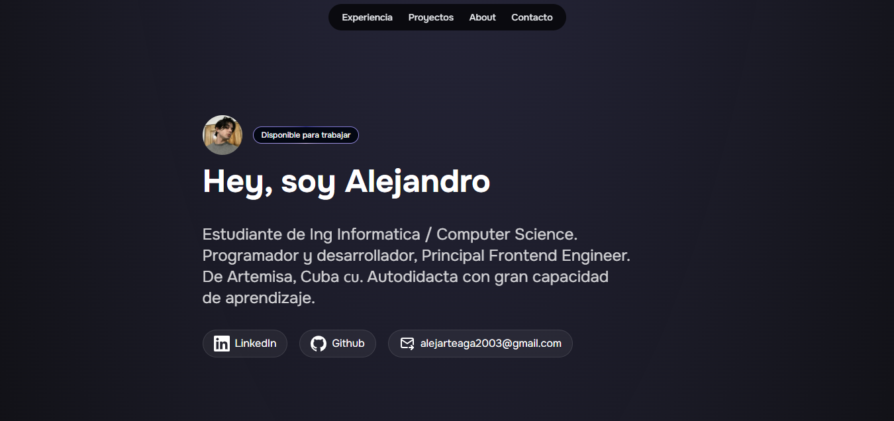

# Mi Portafolio Personal

Este es mi portafolio personal donde muestro algunos de mis proyectos, habilidades y experiencia como desarrollador(a). Está diseñado para ser moderno, responsivo y fácil de navegar.

## ✨ Tecnologías utilizadas

- Astro
- Tailwind CSS

## 🚀 Características

- Diseño responsivo para móvil y escritorio
- Secciones: Sobre mí, Proyectos, Contacto
- Código limpio y estructurado

## 🔧 Instalación

```bash
# Clona el repositorio
git clone https://github.com/MusashiScripts/mi-portafolio.git

# Entra a la carpeta del proyecto
cd mi-portafolio

# Instala las dependencias
npm install

# Inicia el proyecto
npm run dev
```

## 📸 Vista previa




## 📬 Contacto

Puedes contactarme por:

- Correo: alejarteaga2003@gmail.com
- LinkedIn: [Alejandro Arteaga](https://www.linkedin.com/in/alejandro-arteaga-garc%C3%ADa-588415365/)

---

Gracias por visitar mi portafolio ✌️
